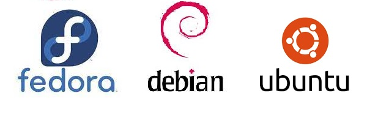

# nix-vm-test

----

*Instant VMs to test your project*



[Get Started](doc/getting-started.md)          [Reference](doc/reference.md)

----------

# README

Testing your project on different Linux distributions is essential, but time-consuming.

**nix-vm-test** allows you to quickly spin up a virtual machine running any of the three major Linux distributions and run your tests using a single CLI command.

## Overview

This project builds on the [NixOS VM test](https://nixos.org/manual/nixos/stable/#sec-nixos-tests) infrastructure to allow you to test your software instantly on Ubuntu, Debian, and Fedora virtual machines.

It runs on any Linux machine with Nix installed.

Your tests can either be used:

- interactively, for development purposes.
- noninteractively. This is perfect for CI, and you can use it as an integration test matrix on a wide variety of Linux distributions.

You configure **nix-vm-test** using Nix package manager, either in a flake or in a `.nix` configuration. This includes defining the parameters of the virtual machine you need for the test, and writing a Python script to define your tests. Once you've built the project, you can create the virtual machine and run your tests with a single CLI command.

-----

## Prerequisites

- A Linux machine

- Nix Package Manager

- Hardware KVM acceleration. The project will run without it, but it will be too slow for practical purposes.

-----

## How to use nix-vm-test

The [Get Started](doc/getting-started.md) guide walks you through setting up and running a simple test scenario.

For more detailed information, see the [Reference](doc/reference.md) guide.

----

## Status of the Project

**Beta-grade**

The API will be backward compatible. The project is already used in some production setups in the wild.

However, expect to experience some paper cuts along the way. Check out the [bug tracker](https://github.com/numtide/nix-vm-test/issues) to see the currently unfixed known bugs and their workaround.

## API Peek

```nix
let
  test = nix-vm-test.lib.ubuntu."23_04" {
    diskSize = "+2M"
    sharedDirs = {
      numtideShare = {
        source = "/home/numtide/share";
        target = "/mnt";
      };
    };
    testScript = ''
      vm.wait_for_unit("multi-user.target")
      vm.succeed("apt-get update")
    '';
    };
in test.sandboxed
}
```

---

This project is supported by [Numtide](https://numtide.com/).


We are a team of independent freelancers that love open source.  We help our
customers make their project lifecycles more efficient by:

- Providing and supporting useful tools such as this one
- Building and deploying infrastructure, and offering dedicated DevOps support
- Building their in-house Nix skills, and integrating Nix with their workflows
- Developing additional features and tools
- Carrying out custom research and development.

[Contact us](https://numtide.com/contact) if you have a project in mind, or if
you need help with any of our supported tools, including this one. We'd love to
hear from you.
